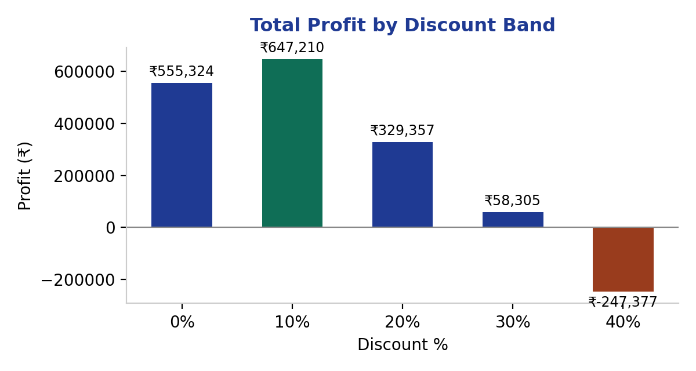
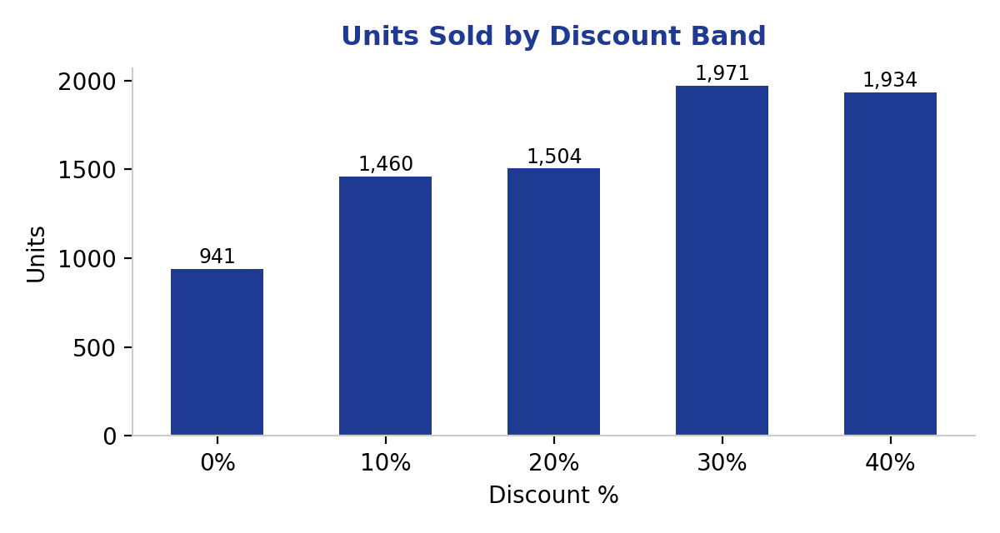

# Retail Pricing & Discount Impact Analysis
### Excel case study — does more discount actually mean more profit?



`#excel` `#pricing-analysis` `#data-analysis` `#retail` `#case-study`

---

## The Question

A general retail business (Electronics, Home Goods, Apparel) runs discounts ranging from 0% to 40% across its orders. Leadership assumes bigger discounts always drive more profit through higher volume. This project tests that assumption using order-level data.

## The Data

320 simulated orders across 3 categories and 12 products, each with unit price, discount %, units sold, cost, revenue, and profit. Built in Excel with **SUMIFS, INDEX/MATCH, and IFERROR** — every summary number is a live formula pulling from the raw data, not a hardcoded value.

## The Finding



Units sold **do** climb steadily as discounts increase — 40% discount sells more than double the units of 0% discount. But profit tells a different story:

| Discount | Total Profit | Profit Margin |
|---|---|---|
| 0% | ₹5,55,324 | 31.7% |
| **10%** | **₹6,47,210** ← peak | 27.9% |
| 20% | ₹3,29,357 | 13.8% |
| 30% | ₹58,305 | 2.0% |
| 40% | **-₹2,47,377** ← loss | -11.5% |

**Profit peaks at just 10% discount, then erodes steadily — by 40% discount, the business is losing money despite selling the most units.** Margin erosion outpaces volume gain well before reaching the deepest discount tiers.

## Why This Matters

This is exactly the kind of finding a Pricing Analyst is hired to catch — the intuitive assumption ("more discount = more sales = more profit") is directionally right on volume but wrong on the metric that actually matters. The workbook makes this auditable: change any input in Raw Data and every downstream number recalculates.

## What's in the Workbook

- **Raw Data** — 320 order-level rows
- **Summary** — SUMIFS-driven breakdown by discount band and by category, with peak-profit and loss rows highlighted
- **Dashboard** — key metric callouts and both charts shown above, built natively in Excel

## Files in this repo

```
README.md
Retail_Pricing_Discount_Analysis.xlsx
assets/
  chart-profit-by-discount.png
  chart-units-by-discount.png
```

## Note

Dataset is simulated for portfolio purposes. Category margins and discount-response patterns are illustrative assumptions, not sourced from a real retailer.
